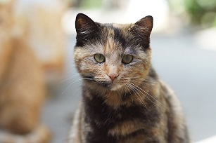

### What is it?
torbie is the name of a R package created to simulate values from three probability distributions: Normal, Poisson and Binomial. It is also the name of a type of cat coat coloring. A torbie is a Tortoiseshell cat with the tabby pattern, also known as *lapjeskat* in Dutch. According to [Wikipedia](https://en.wikipedia.org/wiki/Tortoiseshell_cat) Tortoiseshell cats combine two colours other than white, either closely mixed or in larger patches.



### How to use it
The package provides one function which you can use to generate the simulated values. Following are a number of examples.
```{r, echo=FALSE}
library(torbie)
```

```{r}
simulate_values(5, 'Normal')
simulate_values(5, 'Poisson', lambda=10)
simulate_values(5, 'Binomial', size=10, prob=0.5)
```

